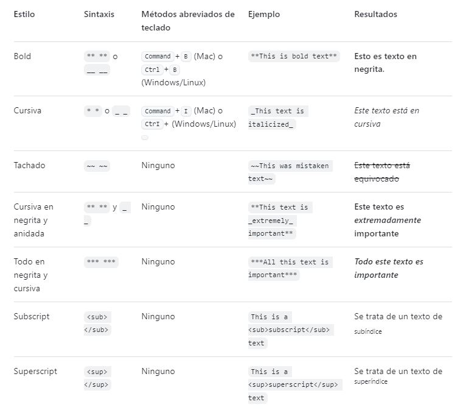

# etiquetas  para los archivos Md

## encabezados 

se agrega  y se integra un texto
cada  cambia la tipo grafia y 
dependiendo los  asi mismo se vera 
afectado la tipo grafia
      

# A first-level heading
## A second-level heading
### A third-level heading


## Entrecomillado de texto
Puede entrecomillar texto con >.

     Text that is a quote

     se le aplica sanguia y un color diferente

     > Text that is a quote

## Estilos de texto

Puedes indicar énfasis con texto en negrita,
cursiva, tachado, o de subíndice o superíndice
en los campos de comentarios y archivos .md.



## Código de cita
Puedes indicar un código o un comando dentro de un enunciado con comillas simples   

            Use `git status` to list all new or modified files that haven't yet been committed.

Para formatear código o texto en su propio bloque distintivo, usa comillas triples.

            Some basic Git commands are:
            
            ```
            git status
            git add
            git commit
            ```

## Listas
Puedes crear una lista sin ordenar. 
Para ello, coloca -, * o + antes de una o más líneas de texto.

            - George Washington
            * John Adams
            + Thomas Jefferson
            
Para ordenar tu lista, antecede cada línea con un número.

            1. James Madison
            2. James Monroe
            3. John Quincy Adams

## Listas de tareas
Para crear una lista de tareas, 
debe añadir como prefijo un guion y espacio,
seguido de [ ] a los elementos de la lista.
Para marcar una tarea como completada, use [x].

            - [x] #739
            - [ ] https://github.com/octo-org/octo-repo/issues/740
            - [ ] Add delight to the experience when all tasks are complete :tada:

Si la descripción de un elemento de la lista de tareas 
comienza por un paréntesis,
necesitará agregar el carácter de escape \:

- [ ] \(Optional) Open a followup issue

## Usar emojis

> [!NOTE]
> Useful information that users should know, even when skimming content.

> [!TIP]
> Helpful advice for doing things better or more easily.

> [!IMPORTANT]
> Key information users need to know to achieve their goal.

> [!WARNING]
> Urgent info that needs immediate user attention to avoid problems.

> [!CAUTION]
> Advises about risks or negative outcomes of certain actions.
Puedes agregar emoji a la escritura escribiendo :EMOJICODE:, 
dos puntos seguidos del nombre del emoji.
